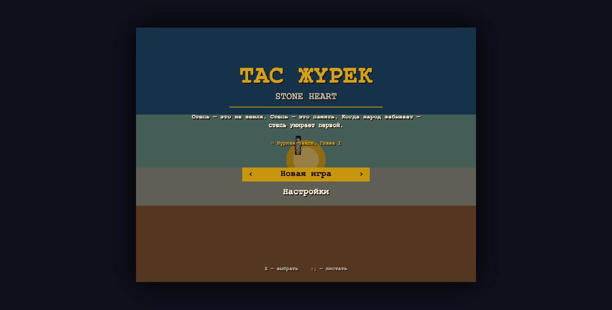
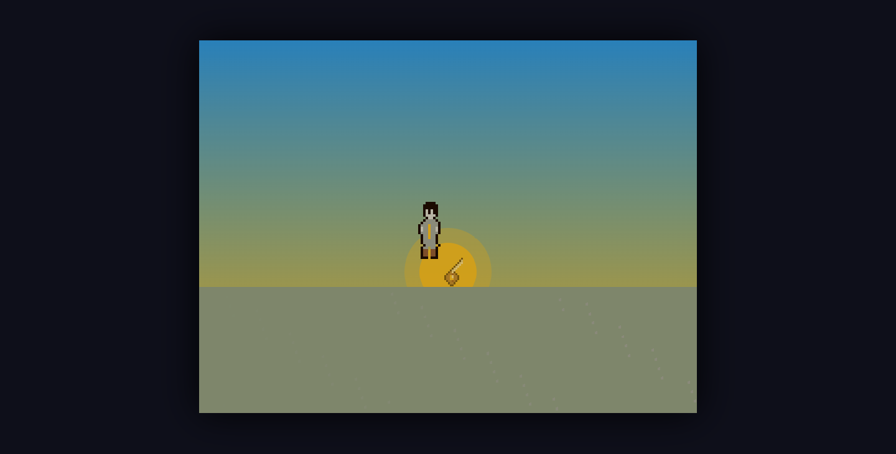
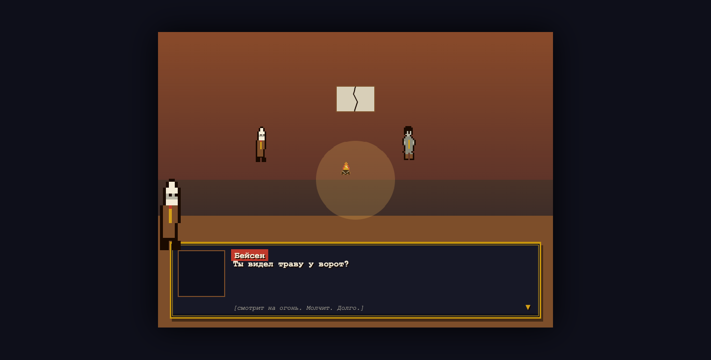
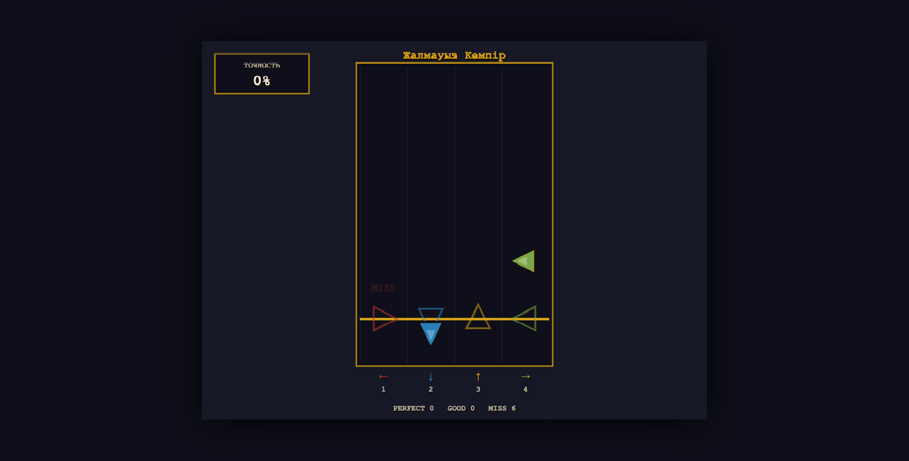

# ТАС ЖҮРЕК · Stone Heart

A single-file pixel-art RPG rooted in Kazakh mythology — about a steppe that is dying because a people is forgetting itself, and a shepherd whose only weapon is a **dombra**.

> «Степь — это не земля. Степь — это память. Когда народ забывает — степь умирает первой.»
> — Нұрлан-бақсы



The whole game is **one `index.html`** — no libraries, no build step to play, no asset files. Graphics are hand-authored pixel sprites drawn to a Canvas; **every sound is synthesized at runtime** with the Web Audio API on the Kazakh pentatonic scale.

---

## ▶ Play

- **Easiest:** download the repo and open `index.html` in any modern browser. It is fully self-contained.
- **Or serve locally:**
  ```bash
  python3 -m http.server 8000
  # open http://localhost:8000/index.html
  ```

### Controls
| Key | Action |
|-----|--------|
| Arrows / WASD | Move |
| **Z** / Enter | Confirm · advance dialogue |
| **Space** | Play the dombra |
| **X** / Esc | Cancel · pause menu |
| **1–4** | Dialogue choices · rhythm lanes (← ↓ ↑ →) |

---

## What's in it

- **8 chapters**, fully scripted with verbatim Russian/Kazakh dialogue.
- **3 worlds** of Kazakh cosmology — Орта (middle), Жер Асты (lower), Аспан (upper).
- **3 endings** (Батыр · Күйші · Хранитель) **+ a hidden New Game+ fourth ending**, chosen by how you played (a hidden kill counter, collected memories, who you trusted, how you spoke to the Dark Khan).
- **The dombra as the core mechanic.** Three bosses (Жалмауыз, Дөнен, the Тень) cannot be touched by a blade — they only yield to the right melody played in a **rhythm minigame**. The canonical ending *is* finishing your father's unfinished kюй by adding four notes of your own.
- **A dying world.** The steppe greys over time; side-quests heal regions and the final map reflects how much of the world you restored.
- **12 petroglyph memories** that unlock flashbacks and reframe the antagonist.
- Branching dialogue with a "play the dombra" option, world decay, quests, and localStorage saves.

| The cold open | Dialogue | The dombra rhythm minigame |
|---|---|---|
|  |  |  |

---

## Tech

- **Vanilla JavaScript** · **Canvas 2D** (800×600, integer-scaled pixel art) · **Web Audio API** (all music & SFX synthesized — `OscillatorNode` / `GainNode` / `BiquadFilterNode`) · **localStorage** saves.
- ~14,600 lines across 12 modules, concatenated into one `index.html`.

### Project layout
```
index.html        ← the shipped game (generated; do not edit by hand)
assemble.py       ← concatenates build/*.js (load order) into index.html
build/
  CONTRACT.md     ← interface spec all modules obey (global state, palette, APIs, ownership)
  00-engine.js    ← state, palette, input, scenes, main loop, save/load
  10-sprites.js   ← pixel-art renderer + all sprite/tile definitions
  20-audio.js     ← Web Audio engine (kюi, themes, SFX)
  30-map.js       ← tilemap, camera, collision, world-decay
  40-dialogue.js  ← branching typewriter dialogue
  50-battle.js    ← battle system + dombra rhythm minigame
  60-memory.js    ← petroglyph memories, quests, endings resolver
  70-ui.js        ← HUD, cutscene player, title/menu/ending screens
  80..83-ch*.js   ← the 8 chapters (scenes, maps, verbatim dialogue, bosses)
DESIGN.md         ← the full game-design document (source of truth)
```

### Rebuild after editing source
Always edit `build/*.js`, then regenerate:
```bash
python3 assemble.py
```

---

## Credits

Built from a complete game-design document (`DESIGN.md`). Music, art, and code are procedural / handcrafted — no third-party assets.
